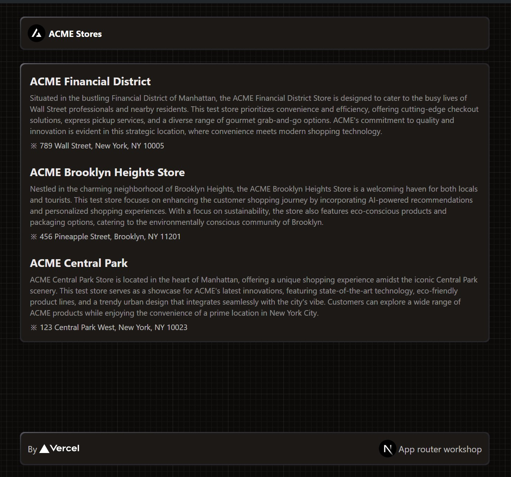

# Next.js workshop - Pages router to App router
This workshop will teach you the Next.js app router essentials coming from prior knowledge on Next.js with pages router. During this workshop you will learn:

* New app router defaults
* Data fetching
* Nested layouts
* Accessing request information
* Streaming and suspense
* Loading fonts
* Comparison with pages

And more.

## Exercises
ACME Stores has some of the best tech items in the market. Their application is built with Next.js using the pages router. Our company was hired to migrate this app from pages router to app router. You were assigned for the task.

The application has two main pages:
* `/` - Home page with a list of the ACME Stores.
* `/[id]` - Store page with the store information and a schedule.
  * `/[id]/rating` - Still showcases information about the store but also displays store's rating and let the user submit a score.

Our task is clear, we need "the same" but embracing all the benefits from the app router and React Server Components. Let's work on it.

Psst! You overheared that long meeting with the client where they mentioned some things that are important for the customer:
* The schedule should show the store's opening hours in the user's locale.
* Ensure users can submit new ratings.
* Fetching ratings might be slow, so show a skeleton while fetching the information.
* Avoid re-rendering or re-fetching information you already have. A nested layout might help in some cases.

They also mentioned that the store information won't change, but the ratings should be up to date. They also want to revalidate the schedule information every 15 minutes because their employee might be out for deliveries.

## Bonus
* Add some skeletons or improve loading states.
* Add an error or global error page in case that something fails.
* Implement a cool alert when the rating is submitted.

## Resources
You can find some snippets to guide you through some of the content ant topics seen during the presentation, in the [snippets](./snippets) folder or refer to the slides in [here](https://docs.google.com/presentation/d/1UIscklSUjKq2DbRLT4qAGHbXEYhUZbEZs2BragMElfg/edit?usp=sharing).

You can also see a variant of this workshop, focused just on app router without mentions to pages router in the [next-app-router-workshop](/vercel-solutions/next-app-router-workshop) repository.
